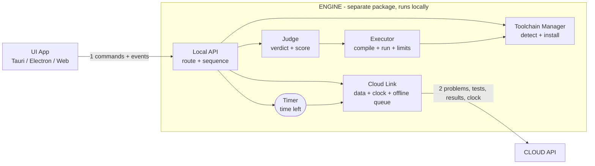

# Client-Side Design: UI + Local Engine

**Principle:** two independent packages that talk only through a small, versioned local API. The UI is just a screen. The Engine does all the work, split into five atomic components, each with one objective and a one-way dependency on the next.

> Naming: to avoid confusion with the cloud server, the client-side "server component" is called the **Engine**.

## Coupling Diagram



Read each arrow as "calls". Every arrow points one way and there are no cycles, so any component can be tested alone by faking the one below it.

## Components

The Engine has **five components**, one for each objective of the client side. The Local API is the connector that joins them and holds no logic of its own.

| Component | Single objective | Takes in | Gives out | Depends on |
|---|---|---|---|---|
| **Executor** | Run one program safely under time, memory and output limits | Language, source code, one input, limits | stdout, exit status, time used, peak memory | Toolchain Manager |
| **Judge** | Turn test cases into a verdict and score | Source code, test cases (sample or hidden), limits | Verdict per test, total score | Executor |
| **Timer** | Keep the remaining time | Deadline, clock offset | Time left, expiry event | Cloud Link |
| **Cloud Link** | Be the only connection to the cloud | Login, requests, results | Problem, tests, limits, server time, queued uploads | None (talks to the cloud) |
| **Toolchain Manager** | Make sure compilers and interpreters exist and work | OS, CPU architecture, toolchain manifest | Tool paths, per-language status | None (downloads from the manifest) |
| *Local API (connector)* | Carry UI commands to the components and events back | UI requests | Responses and live events | Judge, Timer, Cloud Link, Toolchain Manager |

### UI App

| Part | Objective |
|---|---|
| **UI App** | Show things and collect input: login, problem view, editor, Run and Submit buttons, results, countdown, setup progress. It holds no secrets, runs no code and makes no cloud calls |

## Coupling Rules

1. **One-way dependencies.** Calls only go down the arrows in the diagram.
2. **Judge never talks to the cloud.** It receives tests and returns a result. Cloud Link never runs code.
3. **Executor knows nothing about tests, and Judge knows nothing about the OS.** Each can be replaced alone.
4. **The UI sees only the Local API. The cloud sees only Cloud Link.** Credentials and tokens stay inside Cloud Link.
5. **Components exchange plain data** (small structs or JSON), never each other's internals.
6. **Persistence is not a component.** Timer and Cloud Link each keep their own small table in one local SQLite file (the saved deadline and the offline queue).

## Flows

**Run (samples only)**
1. UI sends `POST /v1/run` to the Local API.
2. The API takes the sample tests from Cloud Link's cached problem and passes them with the code to Judge.
3. Judge calls Executor once per test and returns the verdicts.
4. The API returns the result to the UI. Nothing is sent to the cloud.

**Submit (hidden tests)**
1. UI sends `POST /v1/submit`.
2. The API asks Cloud Link for the hidden tests. The cloud releases them only inside the valid time window.
3. Judge runs them through Executor and returns the verdict and score.
4. The API hands the result to Cloud Link, which uploads it, or queues it if offline. The cloud stamps it with server time.

**Time**
1. On login, Cloud Link fetches the deadline and the server time and computes the clock offset.
2. Timer keeps the countdown from the deadline and the offset, saves the deadline to disk, and pushes `timer.tick` events through the API.
3. A UI restart or crash does not reset the timer.

## Local API (v1)

| Endpoint | Purpose |
|---|---|
| `POST /v1/login` | Authenticate through Cloud Link and start a session |
| `GET /v1/problem/{id}` | Statement, sample tests, limits and time window |
| `POST /v1/run` | Run code against the sample tests |
| `POST /v1/submit` | Judge against the hidden tests and upload the result |
| `GET /v1/toolchains` | Status per language: Ready, Missing, Installing |
| `POST /v1/toolchains/{lang}/install` | Install or repair one language |
| `GET /v1/health` | Engine version and API version |
| `WS /v1/events` | `timer.tick`, `run.progress`, `submit.status`, `toolchain.progress` |

The API binds to `127.0.0.1` only (or a Unix socket or named pipe) and requires a random token. The UI checks `/health` on start and shows a clear message if the Engine is too old or too new.

## Executor Constraints

| Constraint | Linux | Windows | macOS |
|---|---|---|---|
| Time limit | CPU and wall timers, kill the process group | Same timers, Job Object kill | Same timers, process group kill |
| Memory limit | cgroups v2 or `setrlimit` | Job Object memory limit | Poll RSS and kill (rlimits are unreliable) |
| Output cap | Stop reading after N MB and fail the run | Same | Same |

- **Space** means peak memory plus the output cap.
- **Exact complexity** cannot be measured directly. Enforce it with hidden tests at several input sizes and a limit per size, set by the moderator in the cloud.
- Every run gets a fresh temp directory, deleted afterwards.

## Toolchain Manager Process

Runs on first launch and from `engine setup`.

1. **Detect the machine:** OS, CPU architecture, libc, free disk space and RAM.
2. **Check what exists:** compare each system compiler or interpreter with the minimum version.
3. **Choose the source:** a valid system install, or the pinned bundle for that OS and architecture from the toolchain manifest.
4. **Install safely:** download, verify SHA-256, extract to a temp folder, rename atomically into the Engine's data directory. No admin rights and no PATH changes.
5. **Smoke test:** compile and run a hello-world per language. Mark it Ready only if the output matches.
6. **Repair:** one command re-downloads and re-verifies a broken toolchain.

Install lazily, so a student who only uses Python never downloads the JDK.

## Packaging and Decoupling

The Engine ships as a **single self-contained binary** per OS and architecture (Go or Rust). The same binary feeds every channel.

| Channel | Engine | UI |
|---|---|---|
| Windows | `.msi` or `winget` package | `.exe` installer |
| Debian/Ubuntu | `.deb` through an apt repository | `.deb` or AppImage |
| npm | Thin wrapper that pulls the right platform binary (the `esbuild` pattern) | Optional, for a web or Electron UI |
| macOS | Homebrew formula | `.dmg` |

- The Engine runs as a background service or starts on demand. It writes its port and token to a small file in the user's data directory.
- The UI reads that file and connects, and starts the installed Engine if none is running.
- The two are versioned separately and only need to agree on the API version.
- Later you can add a CLI, a web UI or a VS Code extension without changing the Engine.

## Repository Layout

```
/engine
  /api          Local API
  /executor     Executor
  /judge        Judge
  /timer        Timer
  /cloudlink    Cloud Link
  /toolchain    Toolchain Manager
/ui             UI App
/api-spec       OpenAPI file shared by both, the single contract
/manifests      Toolchain manifest and schema
/conformance    Infinite loop, big output, memory hog, compile error
```

## Build Order

1. **Toolchain Manager** for one language, then **Executor** on top of it.
2. **Judge**, tested as a command-line tool against test files.
3. **Local API** over Judge, with `/run` and `/health`. Test with `curl`.
4. **Cloud Link**, then **Timer** and the WebSocket events.
5. **UI**, built last against the finished API.
6. **Packaging:** `.deb`, `.msi`, npm wrapper, then the conformance suite on clean VMs.