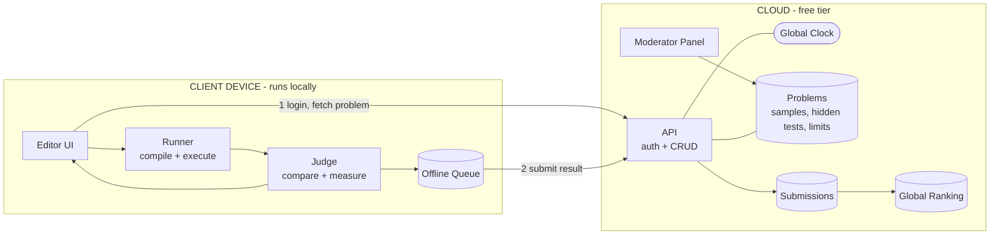

# Training Coding Platform: App Design

**Principle:** keep it simple. Everything that executes code runs on the client device. Everything that needs a single source of truth (users, problems, time, results, ranking) runs in the cloud.

## Architecture Diagram

## Elements

### Client device (runs locally)

| Node | Job |
|---|---|
| Editor UI | Monaco editor, problem view, Run and Submit buttons, results, and the countdown |
| Local Timer | Counts down on the device so the UI stays smooth and works offline (not drawn in the diagram, to keep it simple) |
| Runner | Compiles and executes code in a temp folder, with a timeout and process-tree kill |
| Judge | Compares output with expected output and measures time and memory |
| Offline Queue | Holds the final result until the network is available |

### Cloud (single source of truth)

| Node | Job |
|---|---|
| API | Login, user management, problem delivery, result intake |
| Global Clock | The only clock in the system; defines contest start and end windows |
| Problems | Statement, sample tests, hidden tests, limits (time, memory, expected complexity) |
| Submissions | Every result with its server timestamp and the submitted code |
| Global Ranking | Leaderboard by score and time, updated on each new submission |
| Moderator Panel | Create and edit problems, tests and limits |

## Flows

1. **Setup:** the moderator publishes a problem, its test cases and its limits to the Problems store.
2. **Login:** the client logs in and fetches the problem, the sample tests and the time window from the cloud. The Local Timer syncs once with the Global Clock, stores the offset, and starts counting down.
3. **Run:** Editor UI → Runner → Judge → Editor UI. The code is checked against the sample tests only, with instant feedback and no cloud call.
4. **Submit:** the client fetches the hidden tests, which the server releases only inside the valid time window. The Runner and Judge execute them locally, and the result goes into the Offline Queue, which sends it to the API.
5. **Record:** the API stamps the result with server time, rejects it if it falls outside the window, stores it in Submissions, and updates the Global Ranking.

## Time handling

- The **Local Timer** runs on the client device and drives the countdown shown in the UI. It works offline and needs no polling.
- The **Global Clock** in the cloud is the authority. The timer syncs with it on login, stores the offset between device time and server time, and re-syncs periodically and at Submit.
- The timer is for display only. The server decides whether a submission is on time and stamps the result with server time. A result that arrives after the window closes is rejected, so students must be online when they submit.
- Changing the device clock only changes what the countdown shows. It cannot make a late submission count.

## Design notes

- **Self-reported scores:** the Judge runs locally, so scores are reported by the client. That is acceptable for training. To limit abuse, hidden tests are released only at submit time. The server also checks the timestamp and the submission count, and stores the code so suspicious results can be re-run later.
- **Complexity limits:** a program's exact time or space complexity cannot be measured directly. Enforce it indirectly, with hidden tests at several input sizes and a time and memory limit for each size. A solution with the wrong complexity then fails the large cases.
- **Toolchains:** the Runner uses pinned, checksum-verified compilers delivered through a toolchain manifest, so behavior is the same on every machine.
- **Free tier:** the cloud side only does auth, CRUD, string and score storage, and ranking, which fits free tiers such as Supabase or Firebase.